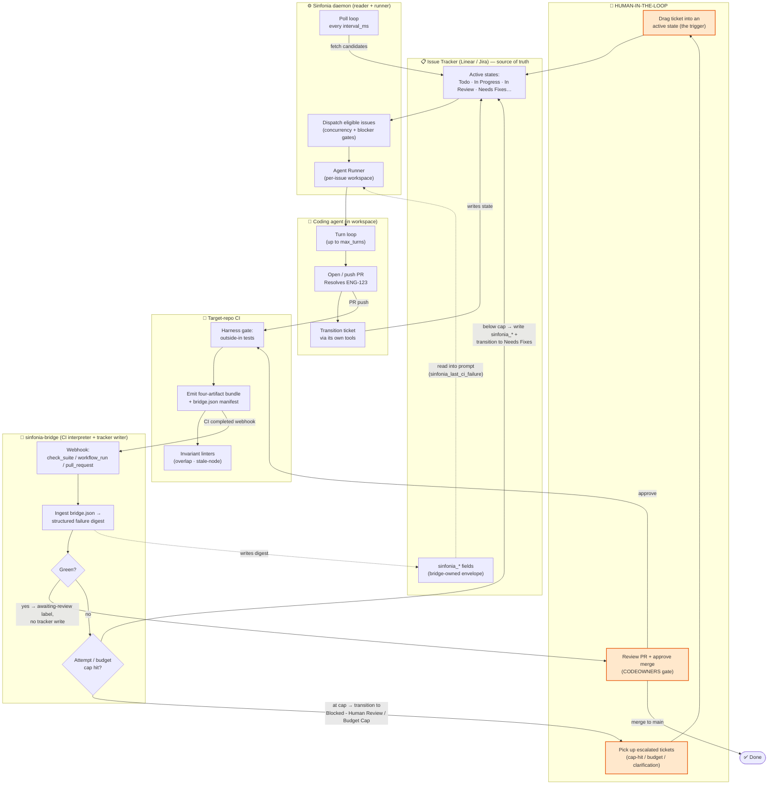
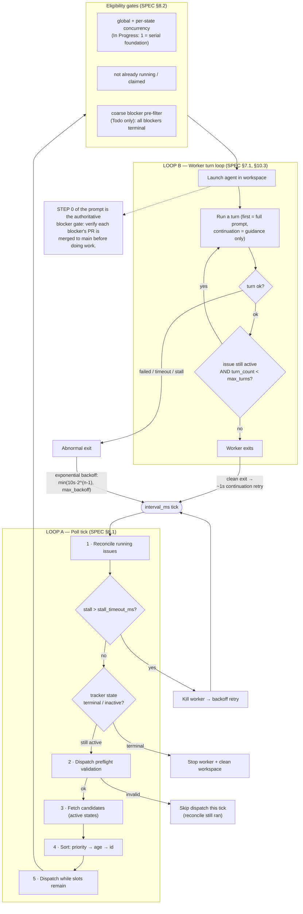
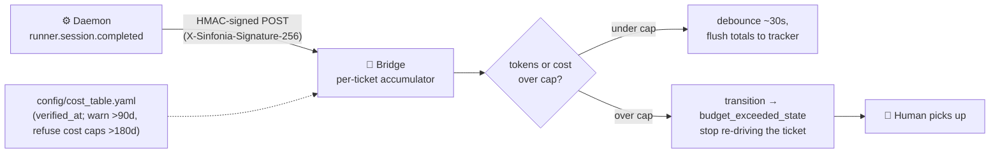

# Architecture — Feedback Loops & the Human in the Loop

- **Status:** *Explanatory (non-normative).* This document is a reading aid for
  the normative specs. Where it summarizes behavior, the cited section in
  [`SPEC.md`](SPEC.md) / [`HARNESS-SPEC.md`](HARNESS-SPEC.md) controls.
- **Audience:** anyone trying to understand how the daemon, the bridge, the
  harness, and the human operator fit together into a closed loop.

This file traces the control flow of a ticket from "dragged into an active
state" to "merged to `main`," and shows the four nested feedback loops that
drive it and the three places a human sits in the loop.

---

## 1. The components at a glance

| Component | Role | Writes to tracker? | Writes to GitHub? | Spec |
|---|---|---|---|---|
| **Sinfonia daemon** (orchestrator) | Polls the tracker, isolates each issue in a workspace, runs a coding-agent session. | **No** (reader only) | No | [`SPEC.md`](SPEC.md) §3–§10 |
| **Coding agent** (per workspace) | Does the actual work; opens the PR; transitions the ticket via its own tools (`gh`/`linear-cli`/`jira`). | Yes (its own creds) | Yes (its own creds) | [`SPEC.md`](SPEC.md) §10, §11.5 |
| **Harness** (in the target repo's CI) | The deterministic sensor: runs outside-in tests, emits the four-artifact bundle + `bridge.json`. | No | No | [`HARNESS-SPEC.md`](HARNESS-SPEC.md) |
| **sinfonia-bridge** | Reads CI results / `bridge.json`, owns the `sinfonia_*` fields, drives the ticket back to a "Needs Fixes" state, enforces attempt/budget caps. | Yes (`sinfonia_*` only) | Yes (labels, PR comments) | [`SPEC.md`](SPEC.md) §11.6 |
| **CODEOWNERS / merge queue** | The human merge gate. Green CI is necessary but never sufficient. | — | — | [`HARNESS-SPEC.md`](HARNESS-SPEC.md) §7.3–§7.4 |

The key trust-boundary fact: **the daemon never touches GitHub and never writes
the tracker.** Ticket writes come from the agent or the bridge; CI-result
interpretation is the bridge's job alone ([`SPEC.md`](SPEC.md) §11.6.1).

---

## 2. The whole system (with the human-in-the-loop marked)



**The closed loop in one sentence:** a human (or upstream process) drops a
ticket into an active state → the daemon dispatches an agent → the agent opens a
PR → CI grades it → the bridge interprets the grade and either routes the ticket
*back* to an active "Needs Fixes" state (which the daemon re-dispatches) or hands
it to a human → and only a human merges.

---

## 3. Loop A & B — the daemon's poll loop and the inner turn loop

Two loops live entirely inside the daemon. Neither touches GitHub or writes the
tracker.



Notes that the diagram compresses:

- **Reconciliation runs before dispatch every tick** ([`SPEC.md`](SPEC.md) §7.4,
  §8.5). A ticket dragged *out* of an active state mid-run is the stop signal —
  the worker is cancelled.
- **The turn loop (Loop B)** keeps one live agent thread alive across multiple
  turns. After each clean turn the worker re-checks the tracker; if still active
  and under `max_turns`, it continues on the same thread with continuation
  guidance rather than resending the original prompt ([`SPEC.md`](SPEC.md) §7.1).
- **Dispatch eligibility** has a *coarse* blocker pre-filter in the orchestrator
  (Todo only, terminal-state membership) and an *authoritative* gate in the
  prompt's STEP 0 (PR-merged-to-`main`, both Todo and In Progress). The two are
  complementary, not redundant ([`SPEC.md`](SPEC.md) §8.2,
  [proposal 0002](proposals/0002-orchestrator-gating-ground-truth.md)).
- **No persistence:** retry timers and live sessions do not survive a restart;
  recovery is tracker- and filesystem-driven ([`SPEC.md`](SPEC.md) §14.3).

---

## 4. Loop C — the CI → fix feedback loop (the bridge)

This is the loop that gives the system its name — the one that turns a red CI run
into a re-dispatched fix attempt, bounded by attempt and budget caps.

```mermaid
sequenceDiagram
    autonumber
    participant AG as 🤖 Agent
    participant GH as GitHub (PR + CI)
    participant HZ as 🧪 Harness
    participant BR as 🌉 Bridge
    participant TR as 📋 Tracker
    participant SF as ⚙️ Daemon
    participant HU as 👤 Human

    AG->>GH: push PR ("Resolves ENG-123")
    GH->>HZ: run harness gate
    HZ->>HZ: outside-in tests →<br/>four-artifact bundle + bridge.json
    HZ-->>GH: upload bridge-{run-id} artifact
    GH->>BR: webhook (workflow_run / check_suite completed)
    BR->>BR: verify HMAC · dedup X-GitHub-Delivery
    BR->>BR: map PR → ticket (regex on PR body)

    alt CI green
        BR->>GH: label awaiting-review (no tracker write)
        Note over BR,HU: hands off to the human merge gate (§5)
    else CI red — ingest bridge.json (§11.6.13)
        BR->>GH: GET run artifacts → download bridge-* (bounded, in-memory)
        BR->>BR: parse failures → structured digest<br/>(scenario · step · assertion · artifact refs)
        BR->>BR: attempts.next() vs max_attempts (+ per-ticket override)
        alt below cap
            BR->>TR: write sinfonia_last_ci_failure (digest),<br/>failure_category, attempt_count
            BR->>TR: transition → "Needs Fixes - X"<br/>(category-routed)
            BR->>GH: label needs-fixes + failure:{cat}, post PR comment
            SF->>TR: poll finds ticket in active "Needs Fixes" state
            TR-->>SF: issue + sinfonia_* fields
            SF->>AG: re-dispatch; prompt reads<br/>sinfonia_last_ci_failure digest
            AG->>GH: fix + push → (loops back to top)
        else at cap (attempts OR budget)
            BR->>TR: transition → "Blocked - Human Review"<br/>/ "Blocked - Budget Cap" (counter NOT advanced)
            BR->>GH: label cap-hit, post explanation comment
            BR->>HU: escalate — loop stops here
        end
    end
```

Key properties (cited so the diagram stays a summary, not a source of truth):

- **Tracker writes happen before label/comment writes** so a mid-call failure
  leaves the tracker correctly state-machined
  (`crates/sinfonia-bridge/src/feedback/transition.rs`).
- **The failure digest is the primary diagnostic channel** for the retry turn.
  It lands in the existing `sinfonia_last_ci_failure` string, so most prompts get
  richer feedback with *no template change* ([`SPEC.md`](SPEC.md) §12.5,
  [proposal 0001](proposals/0001-harness-feedback-ingestion.md)).
- **`bridge.json` is treated as hostile input** (it may come from a fork PR's
  CI): bounded download, zip-bomb defense, scalar-only rendering (never evaluated
  as a template), control-chars stripped ([`SPEC.md`](SPEC.md) §11.6.13).
- **Ingestion degrades gracefully:** no manifest, an unparseable one, or an
  unsupported `schema_version` all fall back to the check-name path. The
  check-name behavior is the floor ([`HARNESS-SPEC.md`](HARNESS-SPEC.md) §7.2,
  [`SPEC.md`](SPEC.md) §11.6.13).
- **Category routing** sends lint failures to a cheap raw-LLM lane and e2e
  failures to a heavier agent, via per-state runner overrides in `WORKFLOW.md`
  ([`SPEC.md`](SPEC.md) §11.6, `WORKFLOW.example.md`).

---

## 5. Loop D — the budget / cost loop

Independent of CI redness, the daemon streams a typed event per finished session
to the bridge, which accumulates per-ticket cost and can short-circuit the whole
machine when a ticket runs away ([`SPEC.md`](SPEC.md) §11.6.11–§11.6.12).



The accumulator is in-process and may be lost on bridge restart; on restart the
bridge re-reads the last persisted totals as a fresh starting point. Budget caps
are an SLO ("don't run away with cost"), not a billing system
([`SPEC.md`](SPEC.md) §11.6.12).

---

## 6. Where the human lives

There are exactly three human touch-points, and none of them is "babysit each
turn":

1. **The trigger (entry).** Moving a ticket into an active state is what starts
   the machine; moving it out is the stop signal ([`README.md`](../README.md)
   mental model, [`SPEC.md`](SPEC.md) §8.1). A human (or an upstream Triage pass)
   owns this.

2. **The merge gate (exit) — the terminal authority.** Green CI is *necessary
   but not sufficient* to merge. CODEOWNERS must cover Sinfonia-touched paths; the
   agent can satisfy checks and address comments but **MUST NOT be able to
   self-merge** ([`HARNESS-SPEC.md`](HARNESS-SPEC.md) §7.3–§7.4). The agent's
   gate is "mergeable w.r.t. `main`" (`BLOCKED`/`UNSTABLE` count as
   ready-for-human; only `DIRTY`/`BEHIND` keep it looping) — human approval
   happens *in* the `In Review` state, it is not the agent's gate
   ([`HARNESS-SPEC.md`](HARNESS-SPEC.md) §7.4).

3. **Escalation (overflow).** When a loop can't reach green within its bounds,
   the ticket is routed to a human instead of looping forever:
   - **Attempt cap hit** → `blocked_state` (e.g. `Blocked - Human Review`).
   - **Budget cap hit** → `budget_exceeded_state` (e.g. `Blocked - Budget Cap`).
   - **Harness escalation** (`escalation_ref`) → the harness emits an explicit
     signal so the consumer can route to a blocked/human-review state
     ([`HARNESS-SPEC.md`](HARNESS-SPEC.md) §4.4).
   - **Triage / Needs Clarification** → an optional first-pass state where a
     human resolves an under-specified ticket before it enters the build loop
     (`WORKFLOW.example.md`).

Everything between the trigger and the gate is autonomous, but the autonomy is
*bounded* — the attempt cap, the budget cap, and the harness escalation path all
exist to make sure a stuck ticket lands on a human's desk rather than burning
turns or dollars.

---

## 7. See also

- [`SPEC.md`](SPEC.md) — the orchestrator + bridge contract (§7 state machine,
  §8 scheduling, §11.6 bridge).
- [`HARNESS-SPEC.md`](HARNESS-SPEC.md) — the producer-side test-feedback contract
  (four artifacts, `bridge.json`, merge gating).
- [`proposals/0001-harness-feedback-ingestion.md`](proposals/0001-harness-feedback-ingestion.md)
  — how the structured digest reaches the retry prompt.
- [`proposals/0002-orchestrator-gating-ground-truth.md`](proposals/0002-orchestrator-gating-ground-truth.md)
  — the dispatch eligibility gates.
- [`proposals/0003-feedback-loop-reliability-seams.md`](proposals/0003-feedback-loop-reliability-seams.md)
  — hardening the three implementation seams in these loops (write contention,
  missed-webhook recovery, restart workspace-reset).
- [`proposals/0004-agent-tool-surface-hardening.md`](proposals/0004-agent-tool-surface-hardening.md)
  — bounding the agent's capabilities so semantic prompt injection has a small
  blast radius (env scoping, permission opt-in, dispatch allowlist).
