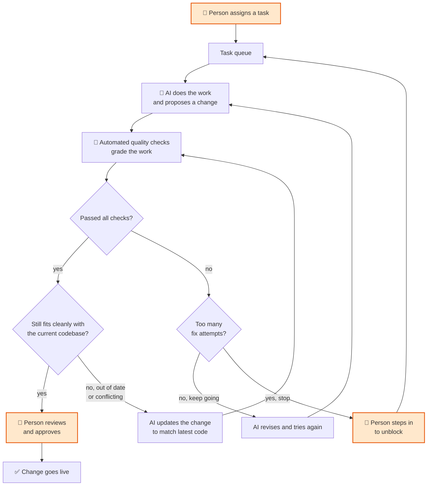
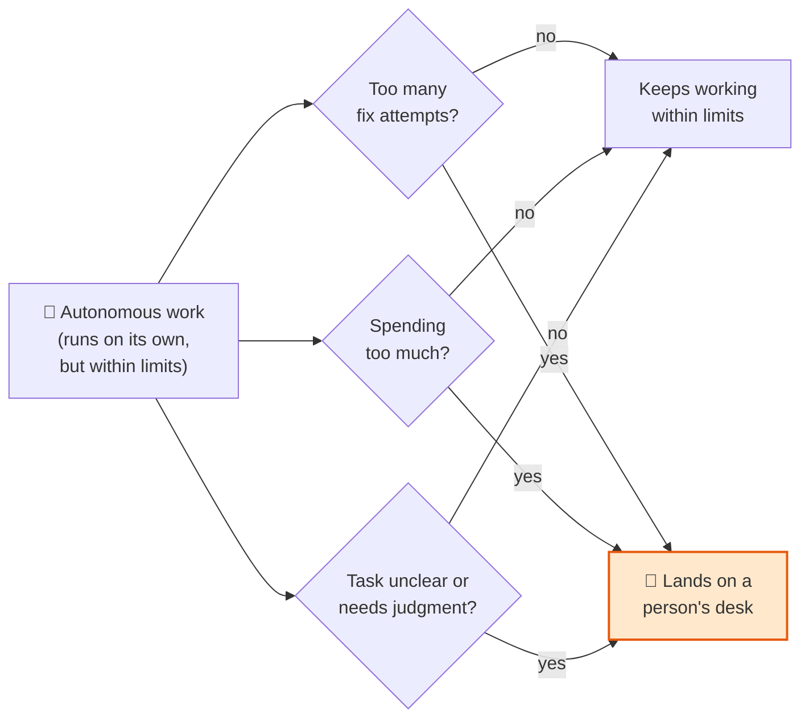

# How the System Works — Executive Overview

## 1. The Lifecycle — how a task moves from assigned to live

**The key point:** the AI never ships on its own. A change must pass its quality
checks *and* still merge cleanly with the current codebase before it can reach a
person, and a person approves every change before it goes live.

---

## 2. The Guardrails — why it cannot run away

**The key point:** three independent limits — number of attempts, cost, and
clarity — each route a stuck task to a person rather than letting it loop forever
or burn budget. Autonomy is real but bounded.
